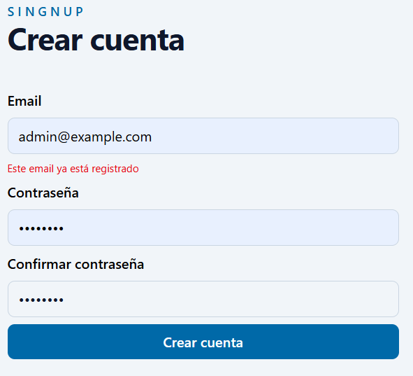

# 02. __Fundamentos de Angular__
## Pagina principal

---

# __Práctica: Layouts__
## Descripción General del Proyecto

Este proyecto fue desarrollado utilizando Angular y TailwindCSS con el objetivo de practicar la creación de layouts modernos y responsivos aplicando diferentes técnicas de maquetación como `Flexbox` y `CSS Grid`.

A lo largo de la práctica se implementaron múltiples distribuciones visuales utilizando componentes reutilizables, tarjetas con estilos personalizados, gradientes, sombras y estructuras adaptables a distintos tamaños de pantalla. Además, se aplicaron conceptos de diseño responsive para mejorar la organización y presentación del contenido.

---

### Distribución Adicional 1: Timeline Vertical
* **Descripción:** Implementa una línea temporal vertical utilizando `flexbox` y una barra lateral decorativa. Cada tarjeta representa una etapa del proyecto y se conecta visualmente mediante indicadores circulares.
* **Comentario en código:** Incluido en la cabecera del `<article>` correspondiente.
* **Captura de pantalla:**

  

---

### Distribución Adicional 2: Bento Grid
* **Descripción:** Utiliza un sistema `grid` con tarjetas de diferentes tamaños mediante `col-span`, creando un dashboard moderno y dinámico para mostrar métricas o estadísticas destacadas.
* **Comentario en código:** Incluido en la cabecera del `<article>` correspondiente.
* **Captura de pantalla:**

  

---

### Distribución Adicional 3: Sidebar Responsive
* **Descripción:** Combina `flexbox` y diseño responsive para dividir la interfaz en un menú lateral y un panel principal adaptable a distintos tamaños de pantalla.
* **Comentario en código:** Incluido en la cabecera del `<article>` correspondiente.
* **Captura de pantalla:**

  

---

### Distribución Adicional 4: Masonry Cards
* **Descripción:** Presenta una distribución asimétrica tipo galería usando `grid` y tarjetas con distintas alturas, ideal para dashboards visuales o paneles analíticos.
* **Comentario en código:** Incluido en la cabecera del `<article>` correspondiente.
* **Captura de pantalla:**

  

---

# __Práctica: Formularios Reactivos y Validaciones en Angular__

## Descripción General

En esta práctica se desarrolló un formulario de registro utilizando Angular Reactive Forms. Se implementaron validaciones síncronas y asíncronas para mejorar la validación de datos ingresados por el usuario.

Entre las validaciones aplicadas se encuentran:
- Campo requerido.
- Validación de formato de email.
- Longitud mínima para contraseña.
- Confirmación de contraseña.
- Validación asíncrona para verificar disponibilidad de email.

Además, se utilizó TailwindCSS para diseñar una interfaz moderna y responsive.

---

## Capturas de Pantalla

### Formulario con errores de validación
* **Descripción:** Se muestran los distintos mensajes de error generados por las validaciones síncronas del formulario, incluyendo campos requeridos, formato inválido de email y contraseñas incorrectas.
* **Captura:**
  

---

### Validación asíncrona del email
* **Descripción:** Se muestra el mensaje de error generado por la validación asíncrona cuando el usuario ingresa un correo electrónico previamente registrado.
* **Captura:**
  
